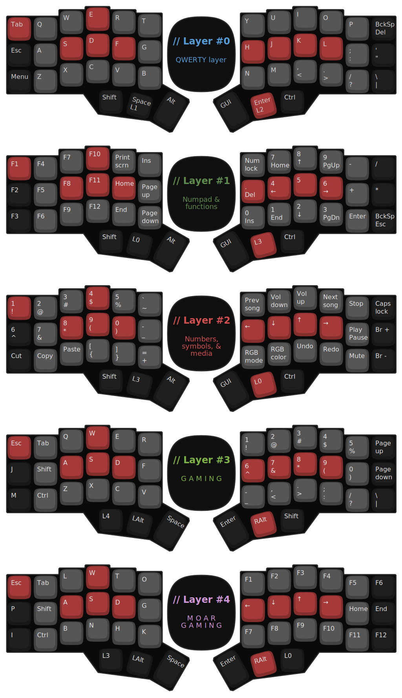

# My firmware for CRKBDv3

A custom firmware written for the [Corne keyboard](https://github.com/foostan/crkbd/) (a DIY ergonomic & ortholinear
keyboard), and based on [QMK](https://github.com/qmk/qmk_firmware/).

## Layout

**NOTES:**

 * *There are 2 "modes" available, `Typing` and `Gaming`; the former comprised of the first 3 layers, while the latter
    corresponds to the last 2.*
   * *The Typing mode is intended for general purpose use, though might be a bit inclined towards coding.*
   * *The Gaming mode focuses heavily in taking advantage of its split nature. This allows it to use the left side
      independently, leaving more room for mouse movement; while also allowing to use both halves in keyboard focused
      titles.*
   * *Even though the keyboard has no indicators to show on which mode its in, you can easily make sure that you are in
      the desired one by pressing either both the inner most thumb keys or the middle thumb keys (the first for getting
      into typing mode, the second to get into gaming mode). Keep in mind that the left key should be pressed before the
      right one, though (at least to get out of gaming mode).*
 * *Keys labelled L0 - L4 are for switching layers. Keys that change from one "mode" to the other are one way, while the
    rest are only active when held.*
 * *The `GUI` key is either Windows, Command, or Super key, depending on the system.*
 * *The `Ctrl/Shift` keys in typing mode are [tap dance](https://docs.qmk.fm/#/feature_tap_dance) keys. This means that
    if you tap (or tap and hold) the key it behaves like the control key, but if you quickly tap twice (or tap once then
    tap and hold) it then behaves like the shift key.*
 * *The `Space/L1` and `Enter/L2` work so that if the keys are only tapped then the first value in inputted, but when
    held then they momentarily activate the assigned layer as long as they remain pressed.*

## How to ...

### Build the keyboard

First, you'll need to acquire the base components for the build. The board schematics are all openly available @
[GitHub](https://github.com/foostan/crkbd/), so you can try and get your own PCBs made wherever you want, but I bought
mine from [Keyhive](https://keyhive.xyz/corne) in a nice kit containing most of the basics. To that I had to add in the
MCUs, a TRRS cable, 42 key switches and keycaps, and a USB-A to USB-C cable.

Once you have everything you just have to put it all together. It is intuitive enough but there is also a
[handy-dandy build guide](https://github.com/foostan/crkbd/blob/master/corne-cherry/doc/v3/buildguide_en.md) that you
follow if needed.

### Put the firmware onto the keyboard

This depends on your system, so I'll reference the [official guide](https://docs.qmk.fm/#/newbs) on this one.

You'll notice though that this is not inside the QMK repo itself, as the guide indicates. That's because I wanted to
keep my own separate repo to keep things simpler (at least, from a certain point of view). To actually be able to use
this keymap you'll need to copy the entire contents of this repo onto a folder inside of the keyboard's
[keymaps folder](https://github.com/qmk/qmk_firmware/tree/master/keyboards/crkbd/keymaps/). Then you can follow the
guide without problem.

## TODOs

 * Don't restart when splitting apart (or at least don't lose the state).
 * Custom lighting depending on current layer.

## Licenses

All the contents of this repo are distributed under the [GPLv3](./LICENSE), except the font
[Victor Mono](https://rubjo.github.io/victor-mono/) used for the image for the layout of the keyboard, which is
distributed under the [MIT license](https://github.com/rubjo/victor-mono/blob/master/LICENSE).
